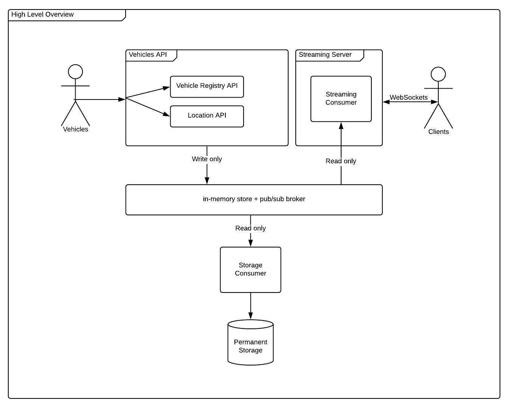

# door2door Backend Exercise

## API Overview

The solution is composed of 3 components.

- Vehicles API
- Storage Consumer
- Streaming Server



#### Tech Stack

- Language: Ruby 2.6.3
- Frameworks:
	- Grape: for the API.
- Technologies
	- Redis: for the store and pub/sub mechanism.
	- MongoDB: for the permanent storage.
	- Eventmachine and WebSockets for the Streaming Server.

### Vehicles API

[Live demo on heroku](https://d2d-backend-api.herokuapp.com)

**Version:** 1

[API Specification](https://d2d-backend-api.herokuapp.com)

This API offer following services.

- Vehicle registration / de-registration.
- Vehicle location update

**Supported Operations**

| Verb | Endpoint | Payload | Response | Description |
| -----------| --------------|----|----|------------ |
| GET | /api/v1/vehicles/health || {"status":"OK"} | Healthcheck |
| POST | /api/v1/vehicles	| ```{"id":"some-uuid"}``` | No content | Registers a vehicle |
| DELETE | /api/v1/vehicles/:uuid	|| No content | De-registers a vehicle |
| POST | /api/v1/vehicles/:uuid/locations	|| No content | Receive vehicle location updates |

### Streaming Server

[Demo on heroku](https://d2d-backend-streaming-server.herokuapp.com)

WebSocket server that streams vehicle location updates to connected clients.

JSON Objects are streamed to clients according to the following schema:

[Location Update JSON Schema](spec/support/api/schemas/location_update.json)

```json
{
  "type": "object",
  "required": ["lat", "lng", "at", "vehicle_id"],
  "properties": {
    "lat": { "type":"number" },
    "lng": { "type":"number" },
    "bearing": { "type":"number" },
    "at": { "type":"string" },
    "vehicle_id": { "type":"string" }
  }
}
```

Example:

```javascript
// Client validation (Browser)
// <script src="https://cdn.jsdelivr.net/npm/json-schema@0.2.5/lib/validate.min.js"></script>

const schema = {
  "type": "object",
  "required": ["lat", "lng", "at", "vehicle_id"],
  "properties": {
    "lat": { "type":"number" },
    "lng": { "type":"number" },
    "bearing": { "type":"number" },
    "at": { "type":"string" },
    "vehicle_id": { "type":"string" }
  }
};

let webSocket = new WebSocket('ws://127.0.0.1:9292/');

webSocket.onmessage = (event) => {
  var location = JSON.parse(event.data);
  console.log(jsonSchema.validate(location, schema));
}
```


## Setup

## Docker

```bash
$ docker-compose build # to build the images
$ docker-compose up    # to start the services (-d to start in daemon mode)
```

## Local

### Pre-requisites
- Redis
- MongoDB

### Instalation

```bash
$ git clone https://github.com/jcfausto/d2d-backend.git
$ cd d2d-backend
$ bundle install
```

### Test before running

Notes:
- Make sure you have MongoDB running on your machine at ```localhost:27017```.
- During tests, redis-server will start and stop.


To make sure everything works fine, run the tests before running the services.

```bash
$ rake test
```

### Running

Notes:
- Make sure you have Redis running and available at ```localhost:6379```
- You'll need 3 terminal windows for running the application.

```bash
# First terminal: start the api
$ rake start:api
```

```bash
# Second terminal: start the consumers
$ rake start:consumers
```

```bash
# Third terminal: start the streaming server
$ rake start:streaming
```

### Using the service

There are a few ways you can test the service.

1. Running door2door's driver simulator.
2. Running a performance test.
3. Manually.

#### Running door2door simulator
See: [Driver Simulator Instructions](https://github.com/door2door-io/d2d-code-challenges/tree/master/resources/driver-simulator)

Note: There's a super simple frontend at ```/public/frontend/``` that can be used for visualizing the streaming of locations.

```bash
# To install the packages
$ yarn
# To run the app
$ yarn start
```

#### Run API Performance Tests

The performance of the API can be verified using [Apache Bench](https://httpd.apache.org/docs/2.4/programs/ab.html) to simulate concurrency and load.

Run the command below to test the API with the following parameters:
|Parameter|value|
|-|-|
|# concurrent clients|100|
|# requests|20.000|

```bash
$ rake perftest
```

Samples:
[Local test execution](support/performance-tests-running-on-docker-local-machine.png) with all services running on Docker locally.
